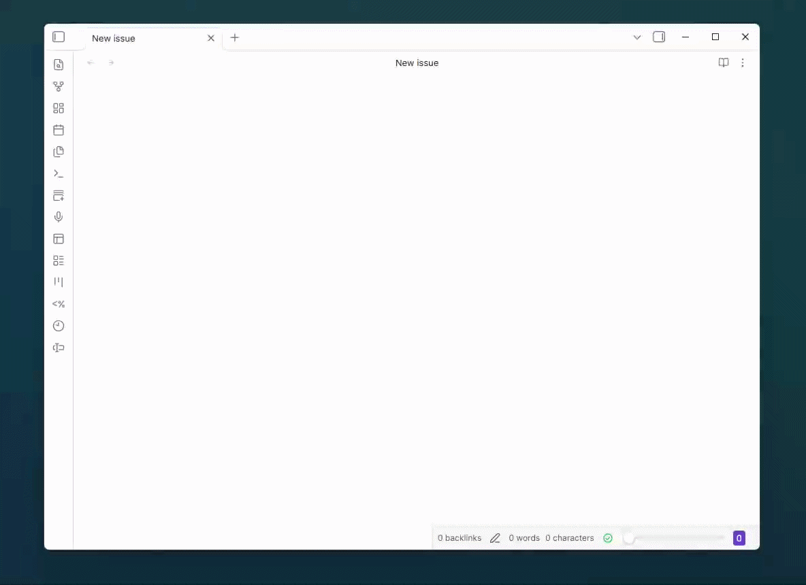

# Placeholder Snippets

An Obsidian plugin for reusable snippets with clickable placeholders that can be replaced by typing.

This local Obsidian plugin adds Word-style placeholders for reusable snippets. 




## Placeholder format

Write placeholders as:

```markdown
{{ph:Title}}
```

In Live Preview they display as clickable tokens such as `[Title]`. Click a token and start typing to replace the whole placeholder.

`{{placeholder:Title}}` also works.

Rendered Markdown blocks, including callouts, are also processed. Clicking a rendered placeholder selects the matching source token in the active note so it can be replaced by typing.

## Commands

- `Placeholder Snippets: Insert placeholder`
- `Placeholder Snippets: Insert title placeholder`
- `Placeholder Snippets: Insert snippet`
- `Placeholder Snippets: Select next placeholder`

## Managing snippets

Go to `Settings -> Community plugins -> Placeholder Snippets` to add, edit, delete, or restore snippets.

Snippets can contain normal Markdown plus any number of placeholders:

```markdown
# {{ph:Title}}

{{ph:Body}}
```

## Coding agent install snippet

Use this instruction with a coding agent to install the plugin into an Obsidian vault:

```text
I want to add Obsidian Placeholder Snippets, a plugin that adds Word-style placeholders for reusable snippets. If you don't know where the Obsidian Vault is, ask the user. To install, download the Obsidian plugin files `manifest.json`, `main.js`, and `styles.css` from `https://github.com/MajesteitBart/obsidian-ph/releases/latest` into `<vault>/.obsidian/plugins/placeholder-snippets/`. 

You can ask follow-up questions to the user. For example, what snippets do you want to use? You can also take the initiative and add snippets that are probably interesting or relevant to your user. Store the snippets in data.json, and make sure to load them when the plugin starts. You can use the following example data as a starting point:

<example_data.json>
    {
        "snippets": [
            {
            "name": "Issue",
            "content": "## Issue {{ph:ID}}\n\n> [!situation]\n> {{ph:Situation}}\n\n> [!expectation]\n> {{ph:Expectation}}\n\n> [!solution]\n> {{ph:Solution}}\n\n"
            }
        ]
    }
</example_data.json>

After finalizing the install and setup, ask the user to:
1. Reload Obsidian (`Ctrl+P`, "Reload app without saving") 
2. Enable the plugin (Settings -> Community plugins -> Placeholder Snippets).
```